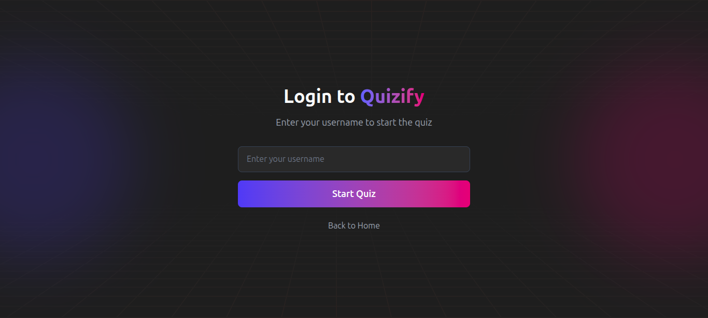
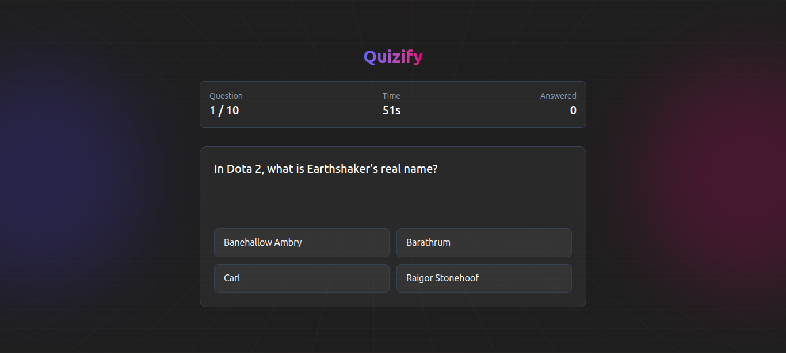
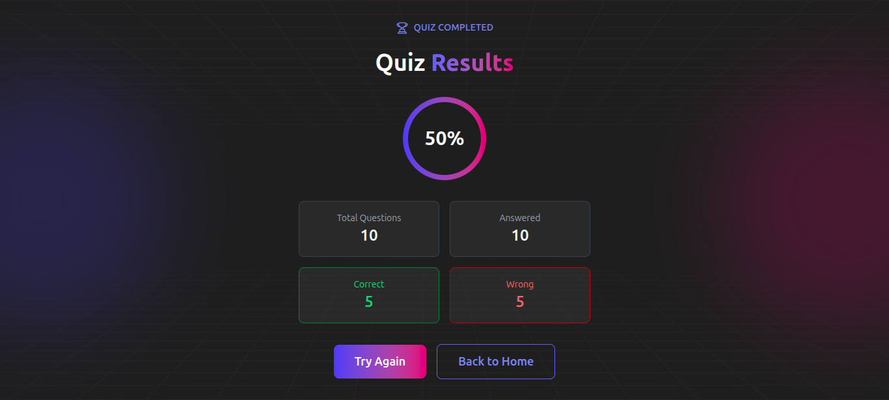

# Quizify

A modern, interactive trivia quiz application built with React and Vite. Test your knowledge with 10 multiple-choice questions fetched from the Open Trivia Database, complete with a countdown timer and score tracking.

## Screenshots

### Home Page


### Login Page


### Quiz Interface


### Results Page


## Features

- **Dynamic Questions**: Fetches 10 random trivia questions from [Open Trivia DB](https://opentdb.com/)
- **Countdown Timer**: 60-second timer to complete all questions
- **Progress Tracking**: Real-time display of current question and answered count
- **Score Calculation**: Percentage-based scoring with detailed results
- **State Persistence**: Quiz progress saved to localStorage (resume where you left off)
- **Responsive Design**: Beautiful UI with Tailwind CSS, works on all devices
- **Gradient Theming**: Modern indigo-to-pink gradient aesthetic

## Tech Stack

- **React 19** - UI framework
- **Vite 7** - Build tool and dev server
- **React Router 7** - Client-side routing
- **Tailwind CSS 4** - Utility-first styling
- **Open Trivia DB API** - Question source

## Getting Started

### Prerequisites

- Node.js 18+ 
- npm or yarn

### Installation

```bash
# Clone the repository
git clone https://github.com/Adityasputra/quizify-app.git
cd quiz-app

# Install dependencies
npm install

# Start development server
npm run dev
```

The app will be available at `http://localhost:5173`

### Available Scripts

| Command | Description |
|---------|-------------|
| `npm run dev` | Start development server with HMR |
| `npm run build` | Build for production |
| `npm run preview` | Preview production build locally |
| `npm run lint` | Run ESLint |

## Project Structure

```
src/
├── api/
│   └── triviaApi.js       # API calls to Open Trivia DB with retry logic
├── assets/                # Static assets
├── components/
│   ├── QuestionCard.jsx   # Question display with answer options
│   └── Timer.jsx          # Countdown timer component
├── context/
│   └── QuizContext.jsx    # Global quiz state management
├── pages/
│   ├── Home.jsx           # Landing page
│   ├── Login.jsx          # Username entry
│   ├── Quiz.jsx           # Main quiz interface
│   └── Result.jsx         # Score display
├── utils/
│   └── shuffle.jsx        # Utility functions (Upcoming)
├── index.css              # Global styles
├── main.jsx               # App entry point
└── routes.jsx             # Route definitions
```

## How It Works

1. **Home**: Welcome page with "Get Started" button
2. **Login**: Enter your username to begin
3. **Quiz**: Answer 10 multiple-choice questions before time runs out
4. **Result**: View your score with correct/wrong breakdown, retry or go home

### State Management

The app uses React Context (`QuizContext`) to manage:
- Questions array from API
- Current question index
- User answers (boolean array)
- Remaining time

State is persisted to `localStorage` allowing users to resume an incomplete quiz.

### API Integration

Questions are fetched from Open Trivia DB with:
- Automatic retry on rate limiting (429 status)
- Exponential backoff delay
- Graceful error handling

## License

This project is licensed under the MIT License - see the [LICENSE](LICENSE) file for details.
